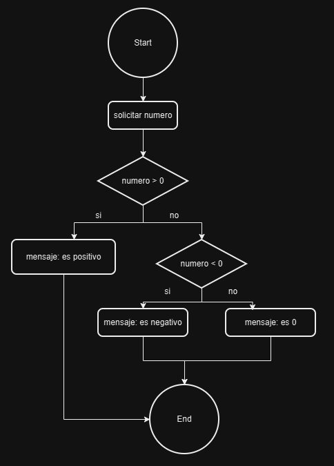
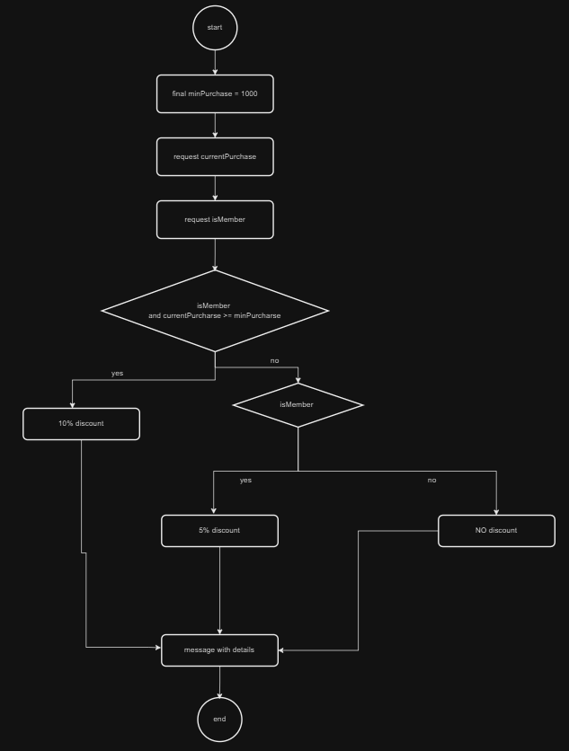
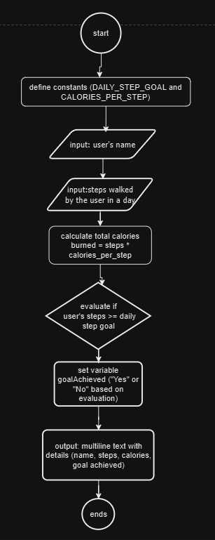
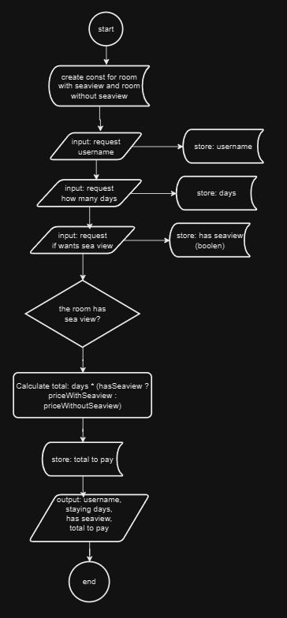
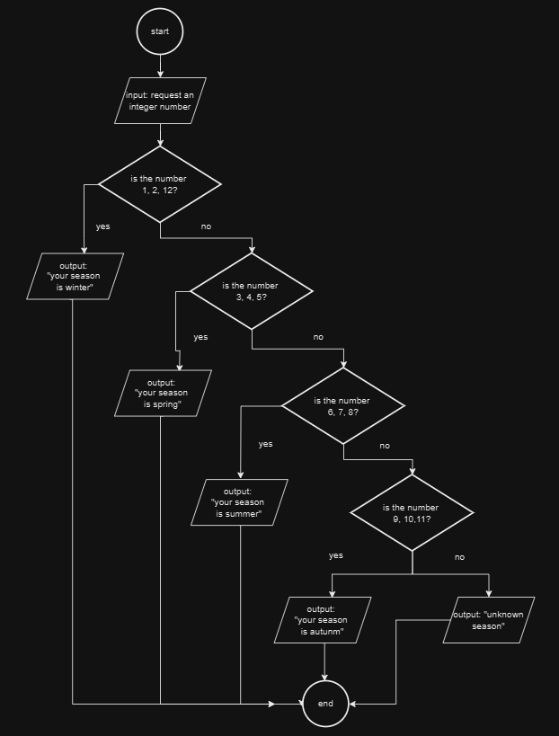
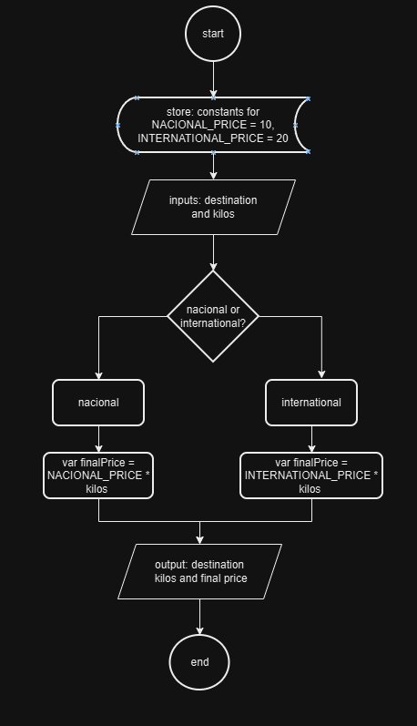

# Seccion 5: Sentencias de decisiones (if-else, switch, yield, operador ternario)

## Índice:

### 1. Ejercicios

- [Ejercicio 1 - Verificador de Números Positivos, Negativos o Cero](#ejercicio-1-verificador-de-números-positivos-negativos-o-cero-if-else-if-else)
- [Ejercicio 2 - Calculadora de Descuento en Compras](#ejercicio-2-calculadora-de-descuento-en-compras-if-else-if-else)
- [Ejercicio 3 - Confirmar Continuación del Servicio](#ejercicio-3-confirmar-continuación-del-servicio-if-else)
- [Ejercicio 4 - Entrada a la Casa de los Espejos](#ejercicio-4-entrada-a-la-casa-de-los-espejos-if-else)
- [Ejercicio 5 - Rastreador de Pasos Diarios](#ejercicio-5-rastreador-de-pasos-diarios-operador-ternario)
- [Ejercicio 6 - Cálculo de Precio de Reserva de Habitación](#ejercicio-6-cálculo-de-precio-de-reserva-de-habitación-operador-ternario)
- [Ejercicio 7 - Encuentra el Número Mayor](#ejercicio-7-encuentra-el-número-mayor-operador-ternario)
- [Ejercicio 8 - Estación del Año (if, else)](#ejercicio-8-estación-del-año-if-else-if)
- [Ejercicio 9 - Estación del Año (switch mejorado)](#ejercicio-9-estación-del-año-switch-mejorado)
- [Ejercicio 10 - Calificación de Letras](#ejercicio-10-calificación-de-letras-con-switch-mejorado)
- [Ejercicio 11 - Costos de envío](#ejercicio-11-costos-de-envío-switch-mejorado-yield)
- [Ejercicio 12 - Validación de Usuario y Contraseña](#ejercicio-12-validación-de-usuario-y-contraseña-switch-mejorado-yield)

### 2. Test

- [Preguntas](#test-sentencia-de-decisiones)
- [Respuestas](#respuestas-del-test)

### 3. Teoria

- [Diagramas de flujo](#diagramas-de-flujo)

---

## **Ejercicio 1: Verificador de Números Positivos, Negativos o Cero (if, else-if, else)**

### **Descripción**

En este ejercicio, crearás un programa que permita al usuario ingresar un número
entero y determine si el número es **positivo**, **negativo** o **cero**. El
objetivo es practicar la lógica condicional y mostrar mensajes claros y precisos
para cada posible resultado.

---

### **Requisitos**

1. **Entrada de Datos:**

   - El usuario debe ingresar un número entero.

2. **Condiciones de Verificación:**

   - Si el número es **mayor que 0**, el programa debe indicar que el número es
     **positivo**.
   - Si el número es **menor que 0**, el programa debe indicar que el número es
     **negativo**.
   - Si el número es **igual a 0**, el programa debe indicar que el número es
     **cero**.

3. **Salida de Datos:**
   - El programa debe mostrar uno de los siguientes mensajes según la condición
     que se cumpla:
     ```
     "Your number is positive"
     "Your number is negative"
     "Your number is 0"
     ```

## Diagrama de flujo

## 

## **Ejercicio 2: Calculadora de Descuento en Compras (if, else-if, else)**

### **Descripción**

En este ejercicio, crearás un programa que **calcule el descuento aplicado a una
compra** según ciertos criterios. El objetivo es que el programa solicite al
usuario algunos datos y, con base en ellos, determine el descuento aplicable, la
cantidad que ahorra y el monto total a pagar.

---

### **Requisitos**

1. **Entrada de Datos:**

   - **Monto de la compra actual**: El usuario debe ingresar cuánto ha gastado
     en la tienda.
   - **¿Es miembro de la tienda?**: El usuario debe indicar si es miembro de la
     tienda (usando `true` o `false`).

2. **Condiciones del Descuento:**

   - Si el usuario es **miembro de la tienda** y ha gastado **1000€ o más**, se
     le aplica un **10% de descuento**.
   - Si el usuario es **miembro de la tienda**, pero ha gastado menos de
     **1000€**, se le aplica un **5% de descuento**.
   - Si el usuario **no es miembro**, no recibe ningún descuento.

3. **Cálculos a Realizar:**

   - Calcula el **porcentaje de descuento** que se aplicará.
   - Calcula la **cantidad de dinero que se ahorra** gracias al descuento.
   - Calcula el **monto total a pagar**.

4. **Salida de Datos:**
   - Muestra el **porcentaje de descuento** aplicado.
   - Muestra la **cantidad de dinero ahorrada** con dos decimales.
   - Muestra el **total a pagar** con dos decimales.

## Diagrama de flujo



---

## **Ejercicio 3: Confirmar Continuación del Servicio (if, else)**

### **Requisitos:**

1. Crea un programa que pregunte al usuario si desea continuar utilizando un
   servicio.
2. Interpreta la respuesta como un valor booleano (`true` o `false`).
3. Usa lógica inversa (`!`) para gestionar la decisión del usuario.
4. Muestra un mensaje adecuado dependiendo de la respuesta.

### **Salida esperada:**

El programa debe generar un mensaje que refleje si el usuario continuará o si el
sistema se cerrará.

---

## **Ejercicio 4: Entrada a la Casa de los Espejos (if, else)**

### Requisitos:

1. Solicita al usuario que ingrese su edad y si tiene miedo a la oscuridad
   (valores `true` o `false`).
2. Define una edad mínima para entrar, establecida como una constante
   (`MIN_AGE`).
3. Evalúa si el usuario cumple ambos criterios:
   - Tener al menos la edad mínima.
   - No tener miedo a la oscuridad.
4. Usa operadores lógicos (`&&`, `!`) para verificar las condiciones.
5. Genera un mensaje dependiendo de si el usuario puede o no ingresar.

### Salida esperada:

El programa debe mostrar un mensaje que confirme si el usuario tiene permitido
entrar o si no cumple con los requisitos para hacerlo.

---

## **Ejercicio 5: Rastreador de Pasos Diarios (Operador ternario)**

### Requisitos:

1. Solicita al usuario los siguientes datos:

   - Su nombre de usuario.
   - El número de pasos dados en el día.

2. Define las siguientes constantes:

   - Una meta diaria de pasos (`DAILY_STEP_GOAL`) igual a 10,000 pasos.
   - Las calorías quemadas por cada paso (`CALORIES_PER_STEP`), establecidas en
     `0.04`.

3. Calcula:

   - Las calorías totales quemadas basadas en el número de pasos dados.
   - Si el usuario cumplió con la meta diaria utilizando un operador ternario.

4. Presenta los resultados con un mensaje formateado de varias líneas que
   incluya:
   - El nombre del usuario.
   - Los pasos dados.
   - Las calorías quemadas.
   - Si alcanzó la meta diaria (muestra "Yes" o "No" con emojis para más
     interacción).
   - La meta diaria de pasos como recordatorio.

### Resultado esperado:

El programa debe mostrar una salida bien estructurada con los detalles de los
pasos y las calorías, motivando al usuario si cumplió o no su meta diaria.

## Diagrama de flujo



---

## **Ejercicio 6: Cálculo de Precio de Reserva de Habitación (Operador ternario)**

**Descripción:**  
Desarrollar un programa en **Java** que gestione el cálculo del precio total de
una reserva de habitación en un hotel, basado en las preferencias del usuario
respecto a la duración de la estadía y la vista al mar.

---

### **Requisitos:**

1. **Entrada de datos**

   - El programa debe solicitar el nombre del usuario.
   - Preguntar cuántos días desea quedarse en el hotel.
   - Confirmar si desea una habitación con vista al mar (`true` / `false`).

2. **Constantes de precios**

   - Habitación con **vista al mar**: `190.50 €` por día.
   - Habitación sin **vista al mar**: `150.50 €` por día.

3. **Cálculo**  
   Utilizar el operador ternario (`? :`) para calcular el precio total
   dependiendo de si la habitación tiene vista al mar o no.

4. **Salida de datos**  
   El programa debe mostrar los detalles de la reserva, incluyendo:
   - El nombre del usuario.
   - Número de días reservados.
   - Si la habitación **tiene** o **no tiene** vista al mar.
   - Precio por día según la elección.
   - Precio total de la estadía.

---

### **Ejemplo de ejecución:**

```
What is your name?: John Doe
How many days would you like to stay?: 5
Would you like to have sea view at your room? (true / false): true

--------------------------
YOUR RESERVATION'S DETAILS
----------------------------
Hello, John Doe
You have 5 days booked with us
Your room has a sea view
The price for day is €190.50
The total price is €952.50
----------------------------
THANK YOU FOR BOOKING WITH US
----------------------------
```

---

### **Objetivos del ejercicio:**

- Practicar el uso de **operadores ternarios**.
- Implementar **formatos de texto multilínea** usando `System.out.printf` y la
  sintaxis `"""`.
- Trabajar con **entradas del usuario** usando `Scanner`.
- Comprender el uso de constantes (`final`).

**Nota:** Recuerda estructurar tu código de forma limpia y con nombres de
variables descriptivos. 🚀

## Diagrama de flujo



---

Aquí tienes la descripción del ejercicio en el formato asignado y adaptado como
lo hemos estado haciendo anteriormente:

---

## **Ejercicio 7: Encuentra el Número Mayor (Operador Ternario)**

### **Descripción del Problema**

En este ejercicio, el usuario debe ingresar **dos números enteros**. La tarea
consiste en identificar cuál de los dos números es mayor utilizando el
**operador ternario (`? :`)**. El resultado debe presentarse al usuario usando
un **string formateado** con el método `.formatted()` en lugar de
`System.out.printf()`.

---

### **Requisitos del Programa**

1. Solicita al usuario ingresar **dos números enteros** desde la consola.
2. Utiliza el **operador ternario** para determinar el número más grande entre
   los dos.
3. Formatea el resultado utilizando el método `.formatted()` para construir un
   mensaje legible.
4. Muestra el resultado final utilizando `System.out.println()`.

---

### **Ejemplo de Ejecución**

#### **Entrada:**

```
Enter the first number: 45
Enter the second number: 78
```

#### **Salida:**

```
The largest number between 45 and 78 is 78
```

---

Aquí tienes la descripción del ejercicio, siguiendo el mismo formato de los
anteriores:

---

## **Ejercicio 8: Estación del Año (if, else if)**

### **Descripción del Problema**

El usuario debe ingresar un **número entre 1 y 12**, correspondiente a los meses
del año. El programa debe determinar y mostrar la **estación del año** a la que
pertenece el número ingresado:

- **1, 2, 12** → Invierno
- **3, 4, 5** → Primavera
- **6, 7, 8** → Verano
- **9, 10, 11** → Otoño

Si el número no está en el rango válido de 1 a 12, el programa mostrará un
mensaje indicando que la estación es desconocida.

---

### **Requisitos**

1. Solicita al usuario un **número entre 1 y 12**.
2. Evalúa el número usando **estructuras condicionales (`if`, `else if`,
   `else`)** para determinar la estación correspondiente.
3. Muestra un mensaje indicando la estación del año.
4. Si el número está fuera del rango, muestra el mensaje: **"Unknown season"**.

---

### **Ejemplo de Ejecución**

#### **Entrada:**

```
Please enter a number (1 -12): 3
```

#### **Salida:**

```
Your season is spring
```

## Diagrama de flujo



---

## **Ejercicio 9: Estación del Año (Switch Mejorado)**

### **Descripción**

Parecido al ejercicio 8, crea un programa en Java que determine la **estación
del año** a partir de un número introducido por el usuario. El número debe estar
en el rango **1 a 12**, donde cada número corresponde a un mes específico del
año.

En este ejercicio, **se recomienda usar el nuevo formato del operador `switch`
mejorado** en lugar de múltiples sentencias `if-else`.

---

### **Requisitos**

1. **Entrada**:

   - El programa solicita al usuario que introduzca un número entre **1 y 12**.

2. **Lógica**:

   - Utiliza la nueva sintaxis del **switch mejorado** con flechas (`->`) para
     determinar la estación según el número introducido:
     - **1, 2, 12** → **Winter**
     - **3, 4, 5** → **Spring**
     - **6, 7, 8** → **Summer**
     - **9, 10, 11** → **Autumn**
     - **Cualquier otro número** → **"unknown"**

3. **Salida**:
   - Muestra un mensaje indicando la estación del año correspondiente.

---

### **Ventajas del Switch Mejorado**

1. **Más limpio y conciso**:
   - No necesitas escribir **`break`** en cada caso, como en el `switch`
     tradicional.
2. **Uso eficiente de múltiples valores**:
   - Puedes agrupar casos con valores separados por comas (ejemplo:
     `case 1, 2, 12`).
3. **Mayor claridad**:
   - La flecha `->` facilita la lectura y el mantenimiento del código.

---

### **Conclusión**

Este ejercicio demuestra cómo usar el **switch mejorado** en Java de manera
eficiente. Es una alternativa más moderna y limpia a las estructuras
tradicionales como `if-else` o el `switch` antiguo.

---

## **Ejercicio 10: Calificación de Letras con (Switch Mejorado)**

### **Descripción del Ejercicio**

Crea un programa en **Java** que solicite un número entre **1 y 10** y devuelva
una **calificación en letras** equivalente usando una estructura `switch`
mejorado. El programa debe asignar las calificaciones siguiendo las siguientes
reglas:

---

### **Requisitos**

1. **Entrada**:

   - El programa solicita al usuario que ingrese un número entre **0 y 10**.

2. **Lógica**:

   - Usa un **switch mejorado** para asignar las calificaciones:
     - **9, 10 → 'A'**
     - **8 → 'B'**
     - **7 → 'C'**
     - **6 → 'D'**
     - **0-5 → 'F'**
     - **Cualquier otro valor → '-'**

3. **Salida**:
   - Imprime un mensaje indicando el **número** ingresado y su **calificación**
     correspondiente.

---

## **Ejercicio 11: Costos de envío (Switch mejorado, yield)**

### **Requisitos:**

Escribe un programa en **Java** que calcule el costo de envío de un paquete en
función de su destino y peso. El programa debe cumplir los siguientes
requisitos:

1. Solicitar al usuario el **destino** del envío:
   - Si el destino es **"national"**, se aplica una tarifa de **10 unidades**
     por kilogramo.
   - Si el destino es **"international"**, se aplica una tarifa de **25
     unidades** por kilogramo.
2. Solicitar al usuario el **peso del paquete** (en kilogramos).
3. Utilizar un **switch mejorado** para realizar la selección del destino y
   calcular el precio:
   - El `switch` debe utilizar **`yield`** para devolver el resultado en casos
     específicos.
   - Manejar un **caso por defecto** que indique que el destino ingresado no es
     válido y asigne un costo de envío de **0**.
4. Mostrar el **costo total** del envío si el destino es válido. Si no lo es,
   informar al usuario que el destino no es válido.

---

### **Entradas:**

1. Una cadena de texto que representa el destino (**"national"** o
   **"international"**).
2. Un número decimal que representa el peso del paquete en kilogramos.

---

### **Salidas Esperadas:**

- Si el destino es válido, el programa debe mostrar el **costo total** del
  envío.
- Si el destino no es válido, se debe mostrar un mensaje informativo y el
  programa no debe realizar cálculos adicionales.

## Diagrama de flujo



---

## **Ejercicio 12: Validación de Usuario y Contraseña (Switch Mejorado, yield)**

### **Requisitos**

Crea un programa que solicite al usuario que ingrese un **nombre de usuario** y
una **contraseña**. El sistema validará estos datos con valores predefinidos:

- El nombre de usuario correcto es **"admin"**.
- La contraseña correcta es **"1234"**.

Dependiendo de la combinación ingresada, el programa deberá mostrar uno de los
siguientes mensajes:

1. **"Welcome to the service"**: Si el nombre de usuario y la contraseña son
   correctos.
2. **"Password incorrect, try again"**: Si el nombre de usuario es correcto,
   pero la contraseña no.
3. **"User incorrect, try again"**: Si la contraseña es correcta, pero el nombre
   de usuario no.
4. **"User and Password incorrect, try again"**: Si tanto el nombre de usuario
   como la contraseña son incorrectos.

---

### **Requerimientos Técnicos**

1. **Utiliza una estructura `switch` mejorada** para implementar la validación.
2. Aprovecha el uso del **`yield`** dentro del `switch` para retornar mensajes
   de forma ordenada.
3. Asegúrate de validar todas las combinaciones posibles entre el usuario y la
   contraseña.

---

### **Entradas y Salidas**

#### **Ejemplo de Ejecución:**

```
Username: admin
Password: 1234
Welcome to the service
```

#### Otro Ejemplo:

```
Username: user
Password: 1234
User incorrect, try again
```

---

### **Nota Importante:**

Aunque este problema se puede resolver más fácilmente con una estructura
**`if-else`**, la finalidad de este ejercicio es que practiques el **switch
mejorado** introducido en versiones recientes de Java y el uso de **`yield`**
para retornar valores en cada caso.

Piensa cómo puedes integrar validaciones condicionales, como `if-else`,
**dentro** del `switch` de manera ordenada y legible.

---

# **Test Sentencia de decisiones**

1. **¿Cuál es la sintaxis básica de una estructura `if` en Java?**  
   a) `if { condición }`  
   b) `if (condición) { ... }`  
   c) `if [condición] { ... }`

---

2. **¿Qué sucede si la condición en un `if` no se cumple y no hay `else`?**  
   a) Se ejecuta la siguiente instrucción después del `if`.  
   b) Lanza un error de sintaxis.  
   c) La ejecución se detiene.

---

3. **¿Cuál es el propósito del bloque `else` en una estructura `if-else`?**  
   a) Evaluar otra condición.  
   b) Ejecutar un bloque si la condición `if` no es verdadera.  
   c) Ignorar condiciones falsas.

---

4. **¿Cómo se escribe correctamente un `if-else` anidado?**  
   a) `if (...) { if (...) { ... } }`  
   b) `else { if (...) { ... }`  
   c) `if { if } { ... }`

---

5. **¿Cuál de las siguientes condiciones es válida?**  
   a) `if (x > y || z)`  
   b) `if (x > y && z > 10)`  
   c) `if x > y { ... }`

---

6. **¿Qué realiza el operador ternario `? :`?**  
   a) Una comparación múltiple.  
   b) Una expresión que devuelve un valor basado en una condición.  
   c) Sirve para ejecutar bloques grandes de código.

---

7. **¿Cuál es la forma correcta de usar el operador ternario?**  
   a) `condición ? "verdadero" : "falso";`  
   b) `? condición : verdadero, falso;`  
   c) `condición : "verdadero" ? "falso";`

---

8. **¿Qué tipo de valores puede evaluar el operador ternario?**  
   a) Solo `int`.  
   b) Valores booleanos.  
   c) Cadenas y números solamente.

---

9. **¿Cómo se estructura un `switch` básico en Java?**  
   a) `switch (variable) { case valor: ... break; }`  
   b) `switch { variable: case -> ... ; }`  
   c) `switch (variable) -> { ... };`

---

10. **¿Qué sucede si falta el `break` en un `case` dentro de un `switch`?**  
    a) No se ejecuta el bloque.  
    b) El programa falla.  
    c) Se produce un _fall-through_ y se ejecutan los siguientes casos.

---

11. **¿Para qué sirve el caso `default` en una estructura `switch`?**  
    a) Es el caso obligatorio en `switch`.  
    b) Se ejecuta si ninguna condición se cumple.  
    c) Se usa solo con valores `boolean`.

---

12. **¿En qué versión de Java se introdujo el `switch` mejorado con `yield`?**  
    a) Java 10  
    b) Java 12  
    c) Java 14

---

13. **¿Qué hace el `yield` dentro de un `switch`?**  
    a) Finaliza el programa.  
    b) Devuelve un valor desde un `case`.  
    c) Evalúa múltiples condiciones.

---

14. **¿Cuál es la ventaja principal del `switch` mejorado?**  
    a) Evita usar `break`.  
    b) Permite realizar operaciones más limpias y devolver valores.  
    c) Es obligatorio usar `default`.

---

15. **¿Cuál de estas sintaxis es válida usando `yield`?**  
    a) `case "X": yield resultado;`  
    b) `case X: yield { resultado };`  
    c) `case X -> resultado;`

---

16. **¿Qué ocurre si no hay un `default` en un `switch` y no se cumplen las
    condiciones?**  
    a) Se ejecuta el último `case`.  
    b) No se ejecuta ninguna acción.  
    c) Lanza una excepción.

---

17. **¿Cuál es la diferencia entre `if-else` y `switch`?**  
    a) `switch` evalúa solo números enteros.  
    b) `switch` evalúa igualdad, mientras `if-else` puede evaluar condiciones
    complejas.  
    c) No hay ninguna diferencia.

---

18. **¿Qué permite el operador `?:` a diferencia de `if-else`?**  
    a) Es más lento que `if-else`.  
    b) Realiza asignaciones directamente en una línea.  
    c) No puede devolver valores.

---

19. **¿Qué tipo de datos puede aceptar un `switch`?**  
    a) Solo `int` y `String`.  
    b) Tipos primitivos, `String`, y enumeraciones.  
    c) Solo valores booleanos.

---

20. **¿Cómo se evalúan múltiples valores en un `case`?**  
    a) `case 1: case 2: ...`  
    b) `case 1 && 2:`  
    c) `case 1 || 2:`

---

21. **¿Qué resultado devuelve el siguiente código?**
    ```java
    int x = 5;
    String result = x > 3 ? "High" : "Low";
    System.out.println(result);
    ```
    a) `High`  
    b) `Low`  
    c) `Error`

---

22. **¿Qué estructura sería más adecuada para comparar intervalos?**  
    a) `switch`  
    b) `if-else`  
    c) Operador ternario

---

23. **¿Cuál de las siguientes es una ventaja del operador ternario?**  
    a) Es más rápido.  
    b) Simplifica las comparaciones simples.  
    c) Permite múltiples bloques de código.

---

24. **¿Qué sucede si no usamos `break` en un `switch` tradicional?**  
    a) Se ejecutan solo los casos válidos.  
    b) El flujo cae en todos los casos siguientes (_fall-through_).  
    c) Se produce un error.

---

25. **¿Cuándo usarías un `switch` en lugar de un `if-else`?**  
    a) Cuando solo se evalúan condiciones de igualdad.  
    b) Siempre.  
    c) Al trabajar con condiciones booleanas.

---

26. **¿Qué valor retorna el siguiente `switch`?**
    ```java
    String msg = switch ("java") {
        case "java" -> "Correct";
        default -> "Incorrect";
    };
    System.out.println(msg);
    ```
    a) `Correct`  
    b) `Incorrect`  
    c) Error

---

27. **¿Qué resultado produce el `yield` en este código?**
    ```java
    int num = 4;
    String result = switch (num) {
        case 3, 4 -> { yield "Four"; }
        default -> "Other";
    };
    ```
    a) `Four`  
    b) `Other`  
    c) Error

---

28. **¿Qué palabra clave se usa para devolver un valor en un `switch`
    mejorado?**  
    a) `return`  
    b) `yield`  
    c) `continue`

---

29. **¿Qué estructura simplifica las decisiones complejas con muchas ramas?**  
    a) `switch`  
    b) `if-else`  
    c) Ambas

---

30. **¿Por qué el `switch` mejorado con `yield` es útil en funciones?**  
    a) Facilita el retorno de valores de un `switch`.  
    b) Reemplaza `if-else` totalmente.  
    c) No es útil en funciones.

---

## **Respuestas del Test**

1. **b) `if (condición) { ... }`**  
   _Porque esta es la sintaxis correcta en Java._

2. **a) Se ejecuta la siguiente instrucción después del `if`.**  
   _Si no hay `else`, simplemente sigue el flujo normal del programa._

3. **b) Ejecutar un bloque si la condición `if` no es verdadera.**  
   _El bloque `else` se activa solo cuando el `if` no se cumple._

4. **a) `if (...) { if (...) { ... } }`**  
   _El anidamiento es correcto colocando `if` dentro de otro `if`._

5. **b) `if (x > y && z > 10)`**  
   _Usa operadores lógicos correctos con una condición válida._

6. **b) Una expresión que devuelve un valor basado en una condición.**  
   _El operador ternario devuelve un valor directamente._

7. **a) `condición ? "verdadero" : "falso";`**  
   _Es la sintaxis correcta para el operador ternario._

8. **b) Valores booleanos.**  
   _El operador ternario evalúa una expresión booleana._

9. **a) `switch (variable) { case valor: ... break; }`**  
   _Sintaxis clásica del `switch` en Java._

10. **c) Se produce un _fall-through_ y se ejecutan los siguientes casos.**  
    _Sin `break`, el flujo continúa en los demás `case`._

11. **b) Se ejecuta si ninguna condición se cumple.**  
    _El `default` funciona como un "caso por defecto"._

12. **c) Java 14**  
    _Java 14 introdujo el `switch` mejorado con `yield`._

13. **b) Devuelve un valor desde un `case`.**  
    _`yield` devuelve un valor para asignarlo a una variable._

14. **b) Permite realizar operaciones más limpias y devolver valores.**  
    _Simplifica el flujo y evita la necesidad de `break`._

15. **a) `case "X": yield resultado;`**  
    _La sintaxis válida para usar `yield`._

16. **b) No se ejecuta ninguna acción.**  
    _Si no hay `default` y ningún `case` se cumple, el flujo continúa._

17. **b) `switch` evalúa igualdad, mientras `if-else` puede evaluar condiciones
    complejas.**  
    _`switch` solo compara igualdad, no expresiones lógicas._

18. **b) Realiza asignaciones directamente en una línea.**  
    _El operador ternario permite devolver un valor en una línea._

19. **b) Tipos primitivos, `String`, y enumeraciones.**  
    _Desde Java 7, `switch` admite `String` y otros tipos._

20. **a) `case 1: case 2: ...`**  
    _Permite agrupar múltiples valores en un solo `case`._

21. **a) `High`**  
    _La condición `x > 3` es verdadera, por lo tanto devuelve "High"._

22. **b) `if-else`**  
    _`if-else` permite evaluar intervalos y condiciones complejas._

23. **b) Simplifica las comparaciones simples.**  
    _El operador ternario es ideal para condiciones simples._

24. **b) El flujo cae en todos los casos siguientes (_fall-through_).**  
    _Sin `break`, se ejecutan los casos siguientes en orden._

25. **a) Cuando solo se evalúan condiciones de igualdad.**  
    _El `switch` es eficiente para comparar igualdad._

26. **a) `Correct`**  
    _El valor `"java"` coincide con el `case` "java"._

27. **a) `Four`**  
    _El `yield` devuelve "Four" porque el `case` incluye el valor `4`._

28. **b) `yield`**  
    _`yield` se usa para devolver un valor en un `switch` mejorado._

29. **c) Ambas**  
    _Ambas estructuras pueden manejar decisiones complejas, según la necesidad._

30. **a) Facilita el retorno de valores de un `switch`.**  
    _El `switch` con `yield` devuelve valores de forma más limpia._

---

# **Diagramas de flujo**

### **¿Qué es un diagrama de flujo?**

Un **diagrama de flujo** es una representación gráfica que muestra los pasos y
decisiones necesarios para realizar un proceso o resolver un problema. Utiliza
**símbolos estándar** conectados por flechas para representar las acciones y el
orden en que ocurren.

---

### **Elementos básicos de un diagrama de flujo**

1. **Inicio/Fin**:

   - Representado por un óvalo.
   - Indica el punto de inicio o finalización del proceso.

2. **Proceso**:

   - Representado por un **rectángulo**.
   - Describe una acción o tarea que se realiza.

3. **Decisión**:

   - Representado por un **rombo**.
   - Muestra una condición o pregunta con dos o más opciones de salida (sí/no,
     verdadero/falso, etc.).

4. **Entrada/Salida**:

   - Representado por un **paralelogramo**.
   - Indica la entrada de datos (como leer una variable) o la salida (imprimir
     resultados).

5. **Flechas**:
   - Conectan los símbolos y muestran el flujo de ejecución del proceso.

---

### **¿Para qué se utilizan los diagramas de flujo?**

- **Comprender procesos complejos** de forma visual.
- **Identificar errores** o ineficiencias en un sistema.
- **Planificar algoritmos** antes de implementarlos en código.
- **Comunicar ideas** y procesos entre personas, como desarrolladores o equipos
  no técnicos.

---

### **Ejemplo simple**

Supongamos que queremos diseñar un proceso que verifique si un número es
positivo o negativo:

1. **Inicio**
2. **Entrada**: Leer número
3. **Decisión**: ¿El número > 0?
   - Sí → Imprimir "Número positivo"
   - No → Imprimir "Número negativo"
4. **Fin**

Esto se traduciría a un **diagrama de flujo** con un inicio, un bloque de
entrada, un rombo de decisión, dos salidas y un final.

---

Los diagramas de flujo son herramientas **poderosas** para analizar y resolver
problemas paso a paso, y son fundamentales para la programación y la lógica
computacional. 💡
