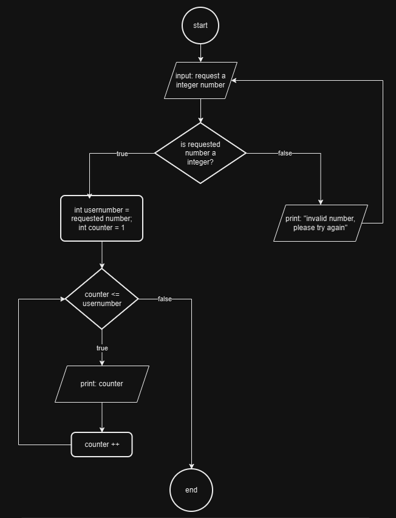
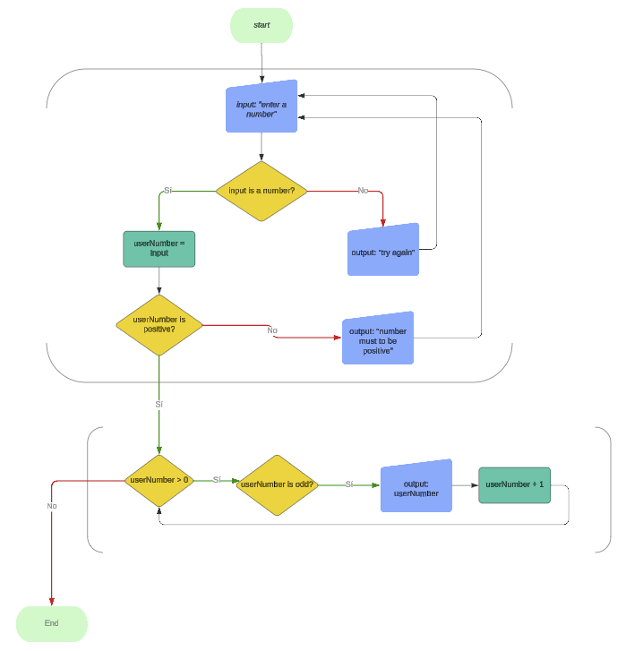
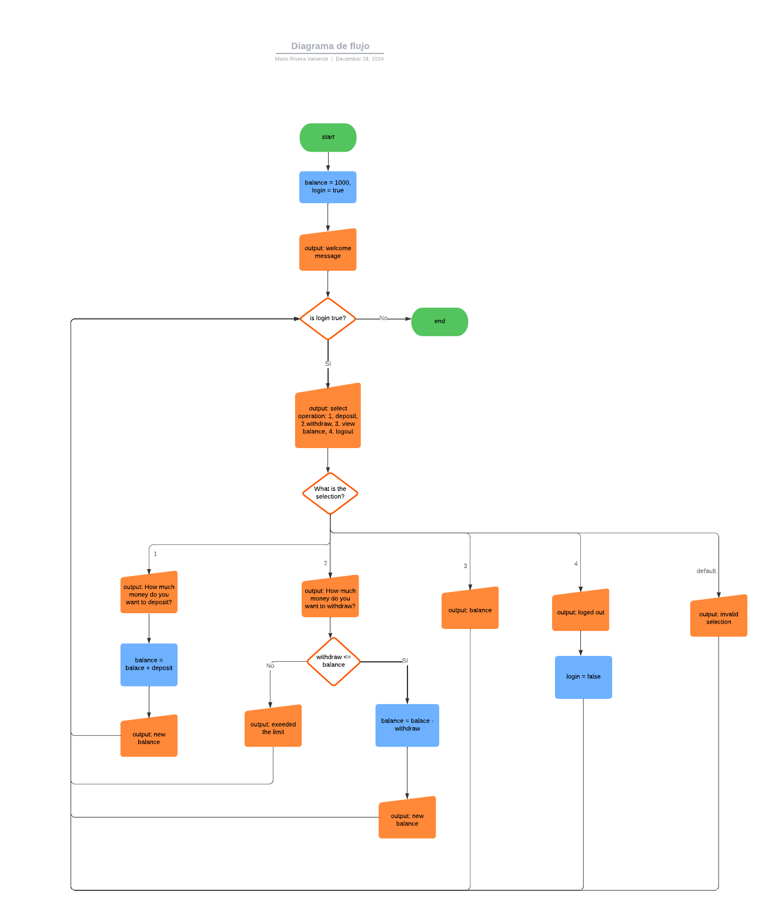
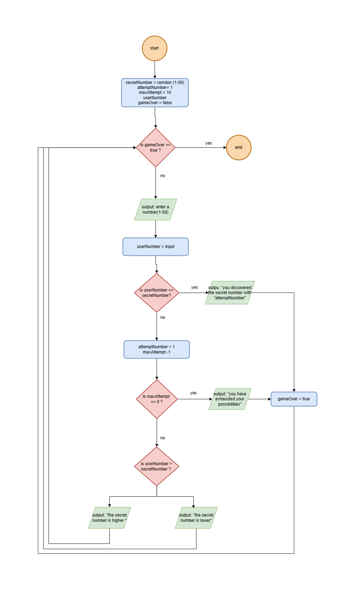

# Seccion 6: Ciclos o Bucles en Java (While, do while, for)

## Índice:

### 1. Ejercicios

- [Ejercicio 1 - Contador numerico con verificación de entrada](#ejercicio-1-contador-numerico-con-verificación-de-entrada-while)
- [Ejercicio 2 - Números pares hasta un valor específico](#ejercicio-2-números-pares-hasta-un-valor-específico-while)
- [Ejercicio 3 - Números imparares descendentes](#ejercicio-3-números-imparares-descendente-do-while)
- [Ejercicio 4 - Suma acomulativa](#ejercicio-4-suma-acomulativa-for)
- [Ejercicio 5 - Cajero automático](#ejercicio-5-operaciones-bancarias-en-un-cajero-automático)
- [Ejercicio 6 - Calculadora básica](#ejercicio-6-calculadora-básica)
- [Ejercicio 7 - Validación de contraseña](#ejercicio-7-validación-de-contraseñas)
- [Ejercicio 8 - Juego adivina número secreto](#ejercicio-8-juego-adivina-el-número-secreto)
- [Ejercicio 9 - Generador de triángulo](#ejercicio-9-generador-de-triángulo)

### 2. Test

- [Preguntas]()
- [Respuestas]()

<hr style="border: 1px solid #136AC7;" />

## **Ejercicio 1: Contador numerico con verificación de entrada (while)**

**Objetivo del ejercicio:** Escribir un programa en Java que solicite al usuario
ingresar un número entero válido. El programa debe usar ciclos para validar la
entrada y repetir la solicitud si el usuario ingresa un dato incorrecto. Una vez
ingresado un número válido, el programa debe imprimir los números del 1 hasta el
número ingresado usando un ciclo `while`.

### Detalles del Ejercicio:

1. **Solicitud de un número entero:**  
   El programa debe solicitar al usuario un número entero. Si el usuario ingresa
   algo no válido, debe mostrar un mensaje de error y repetir la solicitud.

2. **Ciclo de validación:**  
   Usa un bucle infinito (`while (true)`) para asegurarte de que la solicitud se
   repita hasta que el usuario ingrese un dato válido.

3. **Impresión de números:**  
   Una vez ingresado un número entero, usa un segundo ciclo `while` para
   imprimir los números desde `1` hasta el valor ingresado.

4. **Consideraciones:**
   - Verifica si la entrada es válida usando el método `hasNextInt()` de la
     clase `Scanner`.
   - Limpia el buffer de entrada (`console.nextLine()`) si el usuario ingresa un
     dato no válido.

### **Ejemplo de Ejecución**

#### Caso 1: Entrada válida

```
Please enter an integer number: 5
1
2
3
4
5
```

#### Caso 2: Entrada inválida

```
Please enter an integer number: abc
Invalid number, please try again
Please enter an integer number: 7
1
2
3
4
5
6
7
```

### Notas para el estudiante:

- Este ejercicio es ideal para practicar los ciclos `while` y el manejo de
  entradas en Java.
- Aunque puedes resolver esto con otros ciclos (`for`, `do-while`), **en este
  caso, el enfoque es usar `while` exclusivamente.**
- La verificación de entrada con `hasNextInt()` es importante para evitar
  errores y asegurar un programa robusto.

### Diagrama de flujo



<hr style="border: 1px solid #136AC7;" />

## **Ejercicio 2: Números Pares hasta un Valor Específico (while)**

### Descripción:

Crea un programa en Java que permita al usuario ingresar un número entero
positivo y, como resultado, muestre todos los números pares desde 1 hasta el
número ingresado. Si el usuario ingresa un valor inválido (no entero), el
programa deberá informarle del error y solicitar de nuevo un número válido.

### Requisitos:

1. Usa un **ciclo `while`** para solicitar el número hasta que el usuario
   ingrese un valor válido.
2. Usa otro **ciclo `while`** para iterar desde 1 hasta el número ingresado y
   mostrar los números pares.
3. Valida el dato ingresado con un método como `hasNextInt()` para evitar
   errores.
4. Diseña el programa de forma que sea robusto y no termine hasta que el usuario
   ingrese un número válido.
5. Asegúrate de que la salida sea clara, mostrando los números pares separados
   por comas.

### Entradas esperadas:

- Un número entero positivo ingresado por el usuario.

### Salidas esperadas:

- Si el número es válido: Lista de los números pares hasta el valor ingresado.
- Si el número es inválido: Un mensaje indicando el error y solicitando un nuevo
  valor.

### Ejemplo de interacción con el programa:

```
Please enter a integer number: five
Invalid input, try again
Please enter a integer number: -4
Invalid input, try again
Please enter a integer number: 10
2, 4, 6, 8, 10,
```

### Notas para el estudiante:

- Este ejercicio busca que practiques el uso del **ciclo `while`** y la
  validación de entradas.
- Reflexiona sobre cómo usar condicionales (`if`) para realizar cálculos dentro
  del ciclo.
- Recuerda que la implementación con el ciclo `while` es solo una forma de
  resolverlo. Alternativamente, podrías usar otros ciclos como `for` para
  practicar, pero aquí el enfoque será en `while`.
- **Tip:** La validación de la entrada es clave para evitar errores, y el
  programa no debe finalizar hasta que el usuario proporcione un valor correcto.

<hr style="border: 1px solid #136AC7;" />

## **Ejercicio 3: Números imparares descendentes (do, while)**

### Descripción:

En este ejercicio, tu tarea será escribir un programa que solicite al usuario
ingresar un número entero positivo y, utilizando un ciclo `do-while`, imprima en
orden descendente todos los números impares desde el número ingresado hasta 1.

### Requisitos:

1. **Validación del número ingresado:**

   - El programa debe verificar que el usuario ingrese un número entero. Si no
     lo hace, debe mostrar un mensaje de error y solicitar nuevamente el número.
   - También debe asegurarse de que el número ingresado sea positivo. Si el
     número no cumple esta condición, deberá informar al usuario y volver a
     pedir el número.

2. **Uso del ciclo `do-while`:**

   - Una vez que el programa valida que el número ingresado es un entero
     positivo, debe utilizar un ciclo `do-while` para iterar desde el número
     ingresado hacia abajo.
   - Dentro del ciclo, debes comprobar si cada número es impar y, si lo es,
     imprimirlo en la consola.

3. **Estructura clara y mensajes descriptivos:**
   - Asegúrate de incluir mensajes claros para guiar al usuario durante la
     ejecución del programa.

### Ejemplo de ejecución esperado:

```
Please, enter a positive integer number: -5
The number must be positive. Please try again.
Please, enter a positive integer number: abc
Invalid input, try again.
Please, enter a positive integer number: 8
7, 5, 3, 1,
```

### Recomendaciones:

- **Usa un bucle `while` o `do-while`** para la validación de la entrada del
  usuario. Este enfoque asegura que el programa continúe solicitando un valor
  válido hasta que el usuario ingrese uno correcto.
- **Utiliza condiciones dentro del ciclo `do-while`** para determinar si un
  número es impar antes de imprimirlo.
- **Recuerda limpiar el buffer del `Scanner`** en caso de que el usuario ingrese
  datos no válidos.

**Nota:** Este ejercicio tiene como objetivo que practiques el uso del ciclo
`do-while`. Aunque otros enfoques también son posibles, te animamos a usar este
ciclo para cumplir con el propósito didáctico.

### Diagrama de flujo



<hr style="border: 1px solid #136AC7;" />

## **Ejercicio 4: Suma acomulativa (for)**

### Descripción:

Escribe un programa que:

1. Solicite al usuario ingresar un número entero positivo.
2. Utilice un ciclo `for` para recorrer los números del `1` al número ingresado
   por el usuario.
3. En cada iteración del ciclo:
   - Sume el número actual al total acumulado.
   - Imprima en pantalla la operación que se está realizando (por ejemplo,
     `0 + 1 = 1` en la primera iteración).
4. Al finalizar el ciclo, el programa debe haber calculado la suma de todos los
   números del rango y mostrar la suma total.

#### **Ejemplo de ejecución:**

Si el usuario ingresa el número `5`, el programa debe imprimir lo siguiente:

```
Enter a integer number: 5
0 + 1 = 1
1 + 2 = 3
3 + 3 = 6
6 + 4 = 10
10 + 5 = 15
```

El programa calcula que la suma acumulativa de `1` a `5` es `15`.

<hr style="border: 1px solid #136AC7;" />

## **Ejercicio 5: Operaciones bancarias en un Cajero Automático**

En este desafío, aprenderás a implementar un programa que simule el
funcionamiento básico de un cajero automático (**ATM**) utilizando conceptos
clave de programación como estructuras de control `while`, `switch`, y variables
acumulativas.

### **Objetivos del ejercicio**

1. **Interactuar con el usuario:**
   - Solicitar diferentes operaciones como depósitos, retiros, consulta de saldo
     y cierre de sesión.
2. **Usar estructuras de control de flujo:**
   - Implementar un `while` para permitir múltiples operaciones consecutivas
     hasta que el usuario cierre sesión.
   - Usar un `switch` para decidir qué operación ejecutar según la elección del
     usuario.
3. **Gestionar el saldo:**
   - Actualizar el saldo tras depósitos o retiros, validando que no se pueda
     retirar más del saldo disponible.
4. **Hacer uso de buenas prácticas:**
   - Escribir un código claro y organizado con mensajes amigables para el
     usuario.

### **Instrucciones**

1. **Introducción del programa:**

   - Escribe un mensaje de bienvenida que simule la interfaz de un cajero
     automático moderno.
   - Muestra un menú con 4 opciones:
     1. Depositar dinero.
     2. Retirar dinero.
     3. Ver saldo.
     4. Cerrar sesión.

2. **Implementación de cada funcionalidad:**

   - **Depósito:** Solicita al usuario un monto a depositar y actualiza el
     saldo.
   - **Retiro:** Solicita un monto a retirar, validando que no supere el saldo
     actual.
   - **Consulta de saldo:** Muestra el saldo actualizado.
   - **Cerrar sesión:** Termina el programa con un mensaje de agradecimiento.

3. **Manejo de errores:**
   - Si el usuario selecciona una opción no válida, muestra un mensaje de error
     y vuelve al menú principal.

### **Requisitos del programa**

1. Usa un **bucle `while`** para mantener el programa activo hasta que el
   usuario seleccione la opción de cerrar sesión.
2. Usa un **`switch`** para gestionar las opciones del menú.
3. Implementa validaciones de entrada para evitar errores:
   - Asegúrate de que los montos ingresados sean numéricos y mayores a 0.
   - En el caso de retiros, verifica que el monto solicitado no exceda el saldo
     disponible.
4. Escribe mensajes claros y agradables para mejorar la experiencia del usuario.

### Diagrama de flujo



<hr style="border: 1px solid #136AC7;" />

## **Ejercicio 6: Calculadora Básica**

En este ejercicio, vamos a construir una **calculadora interactiva** utilizando
estructuras de control, bucles y manejo de entrada/salida en Java.

---

### Instrucciones del ejercicio:

1. **Objetivo del programa:**  
   Crear una calculadora básica que permita realizar las operaciones de suma,
   resta, multiplicación y división. El programa continuará ejecutándose hasta
   que se ingrese una opción válida y se muestren los resultados.

2. **Pasos principales a implementar:**

   - Mostrar un menú con las opciones de operaciones disponibles:  
     `1. Addition`, `2. Subtraction`, `3. Multiplication`, `4. Division`.
   - Leer las entradas del usuario (selección de operación, primer número y
     segundo número).
   - Verificar que la entrada del usuario sea válida. Si no lo es, mostrar un
     mensaje y pedir una nueva entrada.
   - Realizar la operación seleccionada y mostrar el resultado en un formato
     legible y profesional (por ejemplo, con 2 decimales).
   - Manejar errores como **división por cero** con mensajes adecuados.

3. **Puntos clave:**
   - Usa un **bucle `while`** para permitir reintentos en caso de una entrada no
     válida.
   - Usa un **switch** para ejecutar la operación seleccionada.
   - Usa el formato `System.out.printf` para mostrar los resultados con
     precisión.

---

### **Tareas**

1. **Ejecutar el programa:**  
   Prueba diferentes casos, como:

   - **Suma:** `5 + 3`.
   - **Resta:** `10 - 7`.
   - **Multiplicación:** `2 * 8`.
   - **División válida:** `16 / 4`.
   - **División inválida:** `7 / 0`.

2. **Analizar el código:**  
   Asegúrate de comprender cómo funciona cada parte del programa, incluyendo:
   - **Validación de entrada (`if` con `scanner.hasNextInt()`).**
   - **Switch-case para operaciones.**
   - **Formato de salida con `System.out.printf`.**

---

### Resultado esperado:

1. El programa debe mostrar un menú y esperar que el usuario seleccione una
   opción.
2. Según la selección, solicitará los números, ejecutará la operación y mostrará
   el resultado con un formato adecuado (dos decimales).
3. Si el usuario ingresa algo no válido, debe mostrar un mensaje de error y
   volver a pedir una entrada válida.

<hr style="border: 1px solid #136AC7;" />

## **Ejercicio 7: Validación de contraseñas**

En este ejercicio, practicarás el uso de estructuras de control, manejo de
cadenas y el ciclo `while` para validar entradas del usuario. El objetivo es
crear un programa que permita al usuario ingresar una contraseña con ciertas
restricciones, verificarlas, y aceptarla solo si cumple con los requisitos.

---

#### **Instrucciones:**

1. **Contexto del programa:**

   - El programa debe solicitar al usuario que ingrese una nueva contraseña.
   - La contraseña debe cumplir con las siguientes condiciones:
     - Tener al menos 6 caracteres.
     - No tener más de 10 caracteres.

2. **Flujo del programa:**

   - Mientras la contraseña ingresada no cumpla con las reglas, el programa debe
     seguir solicitando una nueva entrada.
   - Una vez que el usuario ingrese una contraseña válida, el programa debe
     mostrar un mensaje indicando que la contraseña ha sido aceptada y luego
     finalizar.

3. **Pautas para completar el código:**

   - Usa un ciclo `while` para continuar solicitando la contraseña si no es
     válida.
   - Usa los métodos de la clase `String` para verificar la longitud de la
     contraseña.
   - Asegúrate de imprimir un mensaje de error claro cuando la contraseña no
     cumpla con las condiciones.

4. **Restricciones del programa:**
   - El rango de caracteres permitidos debe ser fácil de ajustar en el programa
     (por ejemplo, usando variables como `MIN_CHAR` y `MAX_CHAR`).

<hr style="border: 1px solid #136AC7;" />

## **Ejercicio 8: Juego adivina el número secreto**

### **Descripción**

En este ejercicio, crearás un programa en Java que desafíe al usuario a adivinar
un **número secreto** generado aleatoriamente por la computadora. El objetivo es
proporcionar una experiencia interactiva y entretenida, utilizando estructuras
de control y validaciones para guiar al usuario durante el juego.

---

### **Requisitos del programa**

1. El programa debe generar un número aleatorio entre **1** y **50** al inicio
   del juego. Este será el número secreto que el usuario debe adivinar.

2. El usuario tendrá **10 intentos** para adivinar el número secreto. Cada vez
   que ingrese un número:

   - Si el número es correcto, el programa debe felicitar al usuario y mostrar
     cuántos intentos le tomó acertar.
   - Si el número es incorrecto, el programa debe dar una pista indicando si el
     número secreto es **mayor** o **menor** al número ingresado.

3. Si el usuario no logra adivinar el número en 10 intentos:

   - El programa debe mostrar un mensaje indicando que el juego ha terminado y
     revelar el número secreto.

4. Si deseas, opcionalmente puedes hacer que el programa sea más interesante
   utilizando colores en los mensajes. Por ejemplo:
   - Verde para mensajes de bienvenida.
   - Azul para mensajes de victoria.
   - Rojo para mensajes de error o "game over".

---

### **Pistas para completar el ejercicio**

- Usa la clase `Random` para generar el número secreto. ¿Recuerdas cómo
  hacerlo?  
  Si no, investiga cómo usar el método `nextInt()` de la clase `Random`.

- Usa un bucle `while` para repetir el juego hasta que el usuario gane o se
  queden sin intentos.

- Usa condicionales `if` para comparar la entrada del usuario con el número
  secreto y dar retroalimentación.

- Para manejar entradas inválidas, puedes usar un bloque `try-catch` con la
  excepción `NumberFormatException`.

---

### **Resultado esperado**

Al ejecutar el programa, debería verse algo como esto en la consola (los
mensajes en color son opcionales):

```
WELCOME TO THE GUESSING GAME! 🎉
---------------------------------
Adivina el número secreto entre 1 y 50.

Intento 1: Ingresa un número: 25
El número secreto es mayor.

Intento 2: Ingresa un número: 40
El número secreto es menor.

Intento 3: Ingresa un número: 35
¡Felicidades! 🎉 Adivinaste el número secreto en 3 intentos.
```

O, si el jugador falla todos los intentos:

```
Intento 10: Ingresa un número: 5
GAME OVER. 😢 Has agotado tus intentos.
El número secreto era 7.
```

---

### **Requisitos adicionales (opcional)**

1. **Hazlo más interesante**:

   - Agrega un mensaje especial si el jugador acierta en su **primer intento**.
     Ejemplo: "¡Impresionante! Adivinaste el número en el primer intento."

2. **Configuración personalizada**:

   - Permite al usuario elegir la cantidad máxima de intentos antes de iniciar
     el juego.

3. **Bucles adicionales**:
   - Después de terminar, pregunta al usuario si desea jugar nuevamente.

---

### Diagrama de flujo



<hr style="border: 1px solid #136AC7;" />

## Ejercicio 9: Generador de Triángulo

### Instrucciones:

1. Escribe un programa en Java que genere un triángulo isósceles de una altura
   específica indicada por el usuario. La base del triángulo debe estar
   compuesta por un número impar de caracteres.

2. **Requisitos específicos:**

   - Solicitar al usuario que ingrese la **altura del triángulo** (un número
     entero positivo).
   - Cada nivel del triángulo debe estar centrado en la consola y debe alinearse
     correctamente según la altura.
   - Usar un carácter como `O` para construir el triángulo y rellenar los
     espacios vacíos con blancos (` `).

3. **Ejemplo de entrada y salida:**

   - **Entrada:**
     ```plaintext
     Enter your triangle's height: 5
     ```
   - **Salida esperada:**
     ```plaintext
         O
        OOO
       OOOOO
      OOOOOOO
     OOOOOOOOO
     ```

4. **Puntos clave:**

   - Asegúrate de calcular correctamente la cantidad de espacios en blanco y
     caracteres `O` para cada fila.
   - Usa bucles para repetir las operaciones necesarias.
   - Maneja adecuadamente el formato para que las filas estén centradas en la
     consola.

5. **Consideraciones adicionales:**
   - Validar que la entrada del usuario sea un número entero positivo. Si el
     usuario introduce algo inválido, muestra un mensaje de error y solicita
     nuevamente la altura.

---

### Tips (¡Pero no soluciones!):

- ¿Sabes cómo calcular los espacios en blanco en función de la altura?
- Practica cómo usar el método `String.repeat()` para generar una cantidad
  específica de caracteres.
- Recuerda que cada fila tiene un patrón de **espacios en blanco** seguido por
  **un número impar de caracteres `O`**.

<hr style="border: 1px solid #136AC7;" />

# **Test Ciclos o Bucles**

1. ¿Cuál es la estructura básica de un bucle `for` en Java?  
   a) `for (inicio; condición; actualización) { cuerpo }`  
   b) `for {inicio; condición; actualización} (cuerpo)`  
   c) `for (cuerpo; inicio; condición; actualización)`

---

2. ¿Qué ocurrirá con este código?
   ```java
   for (int i = 0; i < 5; i++) {
       System.out.println(i);
   }
   ```
   a) Imprimirá los números del 0 al 5.  
   b) Imprimirá los números del 0 al 4.  
   c) Generará un error porque falta una instrucción de `break`.

---

3. ¿Cuál es la salida del siguiente código?
   ```java
   for (int i = 1; i <= 3; i++) {
       System.out.print(i + " ");
   }
   ```
   a) `1 2 3`  
   b) `0 1 2`  
   c) `1 2 3 4`

---

4. ¿Qué pasará si se omite la sección de **actualización** en un bucle `for`?  
   a) El bucle no se ejecutará.  
   b) El bucle podría convertirse en un bucle infinito.  
   c) Generará un error de compilación.

---

5. ¿Cuál es la forma correcta de usar varias variables en un bucle `for`?  
   a) `for (int i = 0, j = 5; i < j; i++)`  
   b) `for int i = 0, int j = 5; i < j; i++`  
   c) `for (i = 0, j = 5; i < j; i++)`

---

6. ¿Qué realiza el bucle `while` en Java?  
   a) Ejecuta su cuerpo al menos una vez.  
   b) Ejecuta su cuerpo mientras la condición sea verdadera.  
   c) Ejecuta su cuerpo un número fijo de veces.

---

7. ¿Qué ocurre si la condición de un bucle `while` nunca se cumple?  
   a) El programa genera un error.  
   b) El cuerpo del bucle nunca se ejecuta.  
   c) El bucle se ejecuta infinitamente.

---

8. ¿Qué pasa si olvidas actualizar la condición dentro del cuerpo del bucle
   `while`?  
   a) El bucle termina inmediatamente.  
   b) El programa genera un error de compilación.  
   c) El bucle se convierte en un bucle infinito.

---

9. ¿Cuál es la salida del siguiente código?
   ```java
   int i = 0;
   while (i < 3) {
       System.out.print(i + " ");
       i++;
   }
   ```
   a) `0 1 2`  
   b) `0 1 2 3`  
   c) `1 2 3`

---

10. ¿Cuál es una posible causa de un bucle infinito en un `while`?  
    a) No se actualiza la condición.  
    b) El cuerpo del bucle está vacío.  
    c) Usar una variable de tipo `float`.

---

11. ¿Cuál es la diferencia entre un bucle `while` y `do-while`?  
    a) `while` ejecuta el cuerpo al menos una vez, `do-while` no lo hace.  
    b) `do-while` ejecuta el cuerpo al menos una vez, incluso si la condición es
    falsa.  
    c) No hay ninguna diferencia.

---

12. ¿Cuál es la salida del siguiente código?
    ```java
    int i = 5;
    do {
        System.out.print(i + " ");
        i++;
    } while (i < 8);
    ```
    a) `5 6 7`  
    b) `5 6`  
    c) `5 6 7 8`

---

13. ¿Qué ocurre si la condición de un bucle `do-while` es falsa desde el
    inicio?  
    a) El cuerpo no se ejecuta.  
    b) El cuerpo se ejecuta una vez.  
    c) Genera un error.

---

14. ¿Cuál es la estructura básica de un bucle `do-while`?  
    a) `do { cuerpo } until (condición);`  
    b) `do { cuerpo } while (condición);`  
    c) `{ cuerpo } while (condición);`

15. ¿Qué se imprime en el siguiente código?
    ```java
    int i = 1;
    do {
        System.out.print(i + " ");
        i--;
    } while (i > 0);
    ```
    a) `1 0`  
    b) `1`  
    c) `Nada, genera un error`

---

16. ¿Para qué sirve la palabra clave `break` en un bucle?  
    a) Salir inmediatamente del bucle.  
    b) Saltar la iteración actual del bucle.  
    c) Finalizar el programa.

---

17. ¿Qué ocurre al usar `break` dentro de un bucle `for`?  
    a) Finaliza la iteración actual y pasa a la siguiente.  
    b) Sale del bucle completamente.  
    c) Genera un error.

---

18. ¿Cuál es la salida del siguiente código?
    ```java
    for (int i = 0; i < 5; i++) {
        if (i == 3) break;
        System.out.print(i + " ");
    }
    ```
    a) `0 1 2 3`  
    b) `0 1 2`  
    c) `0 1`

---

19. ¿Se puede usar `break` en un bucle infinito para detenerlo?  
    a) No, no es posible.  
    b) Sí, pero solo en bucles `while`.  
    c) Sí, se puede usar en cualquier tipo de bucle.

---

20. ¿Qué ocurre si `break` se usa fuera de un bucle o `switch`?  
    a) Genera un error de compilación.  
    b) Se ignora.  
    c) Detiene el programa.

---

21. ¿Qué realiza la palabra clave `continue` en un bucle?  
    a) Finaliza el programa.  
    b) Salta el resto del cuerpo del bucle y pasa a la siguiente iteración.  
    c) Sale completamente del bucle.

---

22. ¿Qué se imprime en este código?
    ```java
    for (int i = 0; i < 5; i++) {
        if (i == 2) continue;
        System.out.print(i + " ");
    }
    ```
    a) `0 1 3 4`  
    b) `0 1 2 3 4`  
    c) `0 1 2`

---

23. ¿Qué ocurre si se usa `continue` en un bucle `while`?  
    a) Salta a la próxima iteración.  
    b) Termina el bucle.  
    c) Se ignora.

---

24. ¿Qué ocurre en este código?
    ```java
    int i = 0;
    while (i < 5) {
        i++;
        if (i == 3) continue;
        System.out.print(i + " ");
    }
    ```
    a) `1 2 4 5`  
    b) `1 2 3 4 5`  
    c) `0 1 2 4 5`

---

25. ¿Cuál es una diferencia clave entre `break` y `continue`?  
    a) `break` detiene el bucle, `continue` salta a la próxima iteración.  
    b) `continue` detiene el bucle, `break` salta a la próxima iteración.  
    c) Ambas detienen el bucle.

---

26. ¿Cuál es el resultado de este código?
    ```java
    for (int i = 1; i <= 5; i++) {
        if (i % 2 == 0) continue;
        System.out.print(i + " ");
    }
    ```
    a) `1 3 5`  
    b) `2 4`  
    c) `1 2 3 4 5`

---

27. ¿Qué ocurre al usar `break` en un bucle anidado?  
    a) Sale de ambos bucles.  
    b) Sale solo del bucle más interno.  
    c) Genera un error.

---

28. ¿Qué hace el siguiente código?
    ```java
    int i = 0;
    do {
        if (i == 2) break;
        System.out.print(i + " ");
        i++;
    } while (i < 5);
    ```
    a) `0 1`  
    b) `0 1 2`  
    c) `0 1 2 3`

---

29. ¿Cuál es el efecto de combinar `continue` con un contador mal actualizado?  
    a) Puede crear un bucle infinito.  
    b) El bucle se detiene inmediatamente.  
    c) Se ignora la instrucción `continue`.

---

30. ¿Qué pasa si colocas un `break` dentro de un bloque `if` dentro de un
    bucle?  
    a) Finaliza el bucle si la condición del `if` es verdadera.  
    b) No afecta el bucle.  
    c) Genera un error.

<hr style="border: 1px solid #136AC7;" />

## **Respuestas del Test**

1. **a) `for (inicio; condición; actualización) { cuerpo }`**  
   _Porque esta es la sintaxis correcta para definir un bucle `for` en Java._

2. **b) Imprimirá los números del 0 al 4.**  
   _El bucle comienza en `0` y se ejecuta mientras `i < 5`, deteniéndose antes
   de llegar a 5._

3. **a) `1 2 3`**  
   _El bucle comienza en `1` y se detiene después de imprimir hasta `3` porque
   la condición `i <= 3` se cumple._

4. **b) El bucle podría convertirse en un bucle infinito.**  
   _Si no se actualiza la variable de control, la condición nunca cambiará,
   causando un bucle infinito._

5. **a) `for (int i = 0, j = 5; i < j; i++)`**  
   _Puedes declarar varias variables separándolas con comas en la inicialización
   del `for`._

6. **b) Ejecuta su cuerpo mientras la condición sea verdadera.**  
   _El bucle `while` evalúa su condición antes de ejecutar el cuerpo._

7. **b) El cuerpo del bucle nunca se ejecuta.**  
   _Si la condición es falsa desde el principio, el cuerpo nunca se ejecuta en
   un `while`._

8. **c) El bucle se convierte en un bucle infinito.**  
   _Si no actualizas la variable de control dentro del cuerpo, la condición
   nunca se hace falsa._

9. **a) `0 1 2`**  
   _El bucle se ejecuta mientras `i < 3`, incrementando `i` después de cada
   iteración._

10. **a) No se actualiza la condición.**  
    _La falta de actualización de la condición puede hacer que el bucle nunca
    termine._

11. **b) `do-while` ejecuta el cuerpo al menos una vez, incluso si la condición
    es falsa.**  
    _El `do-while` siempre ejecuta el cuerpo antes de evaluar la condición._

12. **a) `5 6 7`**  
    _El bucle comienza en `5`, incrementa hasta `7` y se detiene porque `i < 8`
    deja de cumplirse._

13. **b) El cuerpo se ejecuta una vez.**  
    _En un `do-while`, el cuerpo siempre se ejecuta al menos una vez._

14. **b) `do { cuerpo } while (condición);`**  
    _Esta es la sintaxis correcta del bucle `do-while`._

15. **b) `1`**  
    _El bucle ejecuta el cuerpo una vez y luego verifica que `i > 0`, que no se
    cumple._

16. **a) Salir inmediatamente del bucle.**  
    _El `break` detiene la ejecución del bucle por completo._

17. **b) Sale del bucle completamente.**  
    _El `break` no solo termina la iteración actual, sino que finaliza todo el
    bucle._

18. **b) `0 1 2`**  
    _El bucle se detiene antes de imprimir `3` porque se encuentra el `break`
    cuando `i == 3`._

19. **c) Sí, se puede usar en cualquier tipo de bucle.**  
    _El `break` es compatible con `for`, `while` y `do-while` para salir de
    ellos._

20. **a) Genera un error de compilación.**  
    _El `break` solo se puede usar dentro de bucles o bloques `switch`._

21. **b) Salta el resto del cuerpo del bucle y pasa a la siguiente
    iteración.**  
    _El `continue` omite las instrucciones restantes del cuerpo y va a la
    siguiente iteración._

22. **a) `0 1 3 4`**  
    _El `continue` salta la iteración donde `i == 2`, por lo que no imprime
    `2`._

23. **a) Salta a la próxima iteración.**  
    _En un bucle `while`, el `continue` va directamente a verificar la condición
    nuevamente._

24. **a) `1 2 4 5`**  
    _El `continue` omite el cuerpo cuando `i == 3`, por lo que no se imprime
    `3`._

25. **a) `break` detiene el bucle, `continue` salta a la próxima iteración.**  
    _La diferencia clave es que `break` sale del bucle y `continue` sigue con la
    próxima iteración._

26. **a) `1 3 5`**  
    _El `continue` omite las iteraciones donde el número es par (`i % 2 == 0`)._

27. **b) Sale solo del bucle más interno.**  
    _El `break` solo afecta al bucle en el que está contenido._

28. **a) `0 1`**  
    _El bucle se detiene al encontrar el `break` cuando `i == 2`._

29. **a) Puede crear un bucle infinito.**  
    _Si el `continue` omite una actualización necesaria, la condición podría no
    cambiar nunca._

30. **a) Finaliza el bucle si la condición del `if` es verdadera.**  
    _El `break` solo se ejecuta cuando la condición `if` se cumple._
